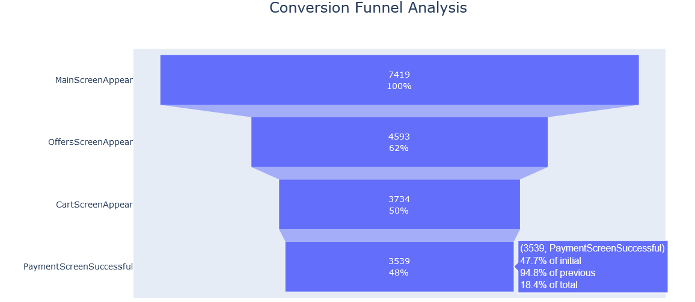
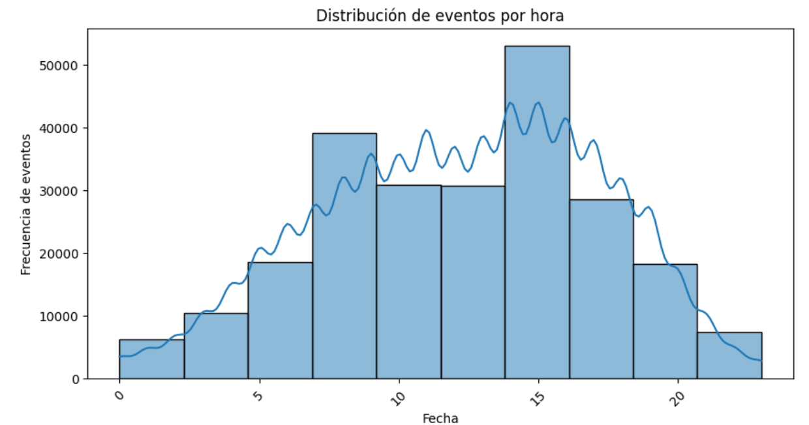

# Sales funnel and A/A/B test analysis

## Project background
This project focuses on understanding user behavior within the mobile application of a food products startup. The primary goal is to analyze the sales funnel to uncover how users progress through the purchasing process. Additionally, the project examines the results of an A/A/B test to inform decisions about potential design changes in the app. Specifically, the test results will guide the design team's final decision regarding font updates.

The data for this analysis comes from user activity logs. Each log entry represents a user action or event within the app, providing a detailed view of how users interact with various features and progress through the funnel.  

Key questions include:

- How many users reach the purchase stage?
- At which stages do users tend to drop off?
- Are there specific stages that pose significant barriers?
- Which set of fonts provide better conversion rates across different stages?

## Executive summary
**Sales funnel analysis**
- The analysis reveals that only 18.4% of users complete the entire process up to payment. The stage where most users drop off is when they are shown offers, with only 61% of initial users who viewed the homepage reaching this stage. However, other stages of the funnel show strong conversion rates, ranging between 81% and 95%.

- On average, each user goes through 3 different events and the most popular stage is the main screen visualization.
- Users are more active on the app between 9:00 AM and 4:00 PM. Specifically, there is a peak in activity around 3:00 PM, indicating that this is when the highest number of events take place.

**A/A/B test analysis**
- The conversion proportions for each event were compared between the test group and each control group, as well as with the combined groups. The analysis revealed no significant differences in the proportion comparisons for any event.

## Recommendations:
1. **Optimize the Offer Display Stage:** Since the largest drop-off happens during the "OffersScreenAppear" stage, consider testing ways to improve engagement at this step. For example, simplifying the offers display, highlighting popular or relevant offers, or personalizing the offers could help increase conversion rates.
   
3. **Conduct Further Exploration on Conversion Bottlenecks:** While the analysis suggests no significant issues with the font change, it would be beneficial to dig deeper into user behaviors at the "OffersScreenAppear" stage. Conducting user interviews, usability testing, or analyzing session recordings could uncover specific issues that are leading to higher drop-off at this step.
   
5. **Leverage Statistical Findings to Optimize Design Changes:** The results of the A/A/B test show that changes to fonts did not have a statistically significant impact on conversion rates. This indicates that it is safe to proceed with altering the fonts across the application, as it is unlikely to harm the user experience or conversion rates.
 
